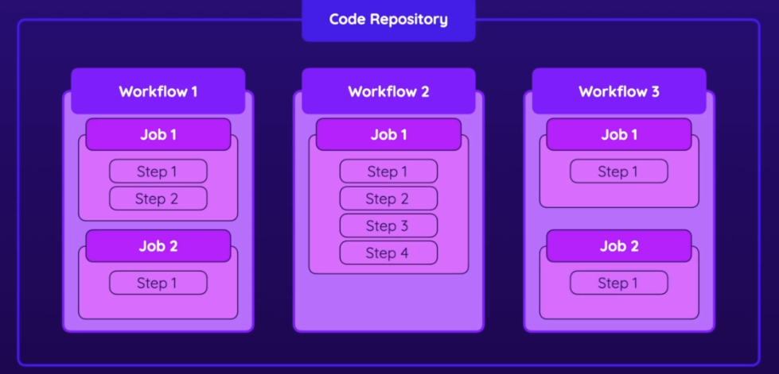

# github-action-1-introduction
GitHub Actions is a feature of the GitHub platform that allows you to automate various workflows in your software development projects. With GitHub Actions, you can define custom workflows that execute a series of steps, such as building and testing your code, deploying your application, or notifying your team about code changes.

These workflows are defined in YAML files that are stored in your GitHub repository, making it easy to version control and collaborate on them with other members of your team. You can also use pre-built Actions from the GitHub Marketplace, or create your own custom Actions to perform specific tasks.

GitHub Actions can be triggered by various events, such as pushing code to a branch, opening a pull request, or creating a new release. They can run on GitHub-hosted virtual machines or your own infrastructure, allowing you to tailor your workflows to your specific needs.

Overall, GitHub Actions provides a powerful and flexible way to automate your software development processes and improve your team's productivity.

## workflow, jobs and steps
In GitHub Actions, a workflow is a configurable automated process that you can define and execute in response to specific events or on a schedule. Workflows are defined in YAML files and stored in your GitHub repository under the `.github/workflows` directory.

A workflow consists of one or more jobs, each of which can run on a separate virtual machine or container. Jobs contain a series of steps that define the actions to be performed, such as checking out the code, building the application, running tests, deploying to a server, and sending notifications.

Workflows can be triggered by various events, such as pushing code to a branch, opening a pull request, or creating a new release. You can also trigger workflows on a schedule or manually from the GitHub web interface or API.

GitHub Actions provides a wide range of pre-built actions that you can use in your workflows, such as checkout, setup-node, and deploy. You can also create your own custom actions to perform specific tasks.

Overall, workflows in GitHub Actions provide a powerful and flexible way to automate your software development processes and improve your team's productivity.



### Here is a simple action
```
name: This is first action for learning github action
on: workflow_dispatch  # -----> manually triger the workflow
jobs:
  first-job:
    runs-on: ubuntu-22.04
    steps:
      - name: use echo command
        run: echo "hello world, This is my first github action"
      
      - name: show time
        run: date
        
      - name: say good bye
        run: echo "good bye."


```